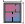
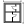
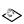

# Deserialize Core 
**Name:** Deserialize Core  
**NickName:** CoreDeserialize  
**Description:** Convert Cores Json back to their geometries  

### Input
| Name | NickName | Description |
| ------ | ------ | ------ |
| File Path | FilePath | The path to find |
| File Name | FileName | The name to find |
### Output
| Name | NickName | Description |
| ------ | ------ | ------ |
| Vertical Circulation | vertical circ | A list of target vertical circualtion as lifts and stairs curves  |
| Horizontal Circulation | horizontal circ | A list of corridor curves for cores  |
| Design Meshes | meshes | A list of target meshes you serialized with your core curves. i.e walls or hatches |
| Smoke Area Mesh | Smoke Meshs | List of the meshes placed when the core is placed in a certain condition that requires a smoke area "RockSluis" in dutch |
| Smoke Area Curves | Smoke Curves | List of the curves placed when the core is placed in a certain condition that requires a smoke area "RockSluis" in dutch |
# Serialize Core 
**Name:** Serialize Core  
**NickName:** CoreSerialize  
**Description:** Convert Cores into Json  

### Input
| Name | NickName | Description |
| ------ | ------ | ------ |
| Vertical Circulation | vertical circ | A list of target vertical circualtion as lifts and stairs curves you would like to serialize |
| Horizontal Circulation | horizontal circ | A list of corridor curves for cores that you would like to serialize  |
| Design Meshes | meshes | A list of target meshes you would like to serialize with your core curves. i.e walls or hatches |
| Smoke Area Mesh | Smoke Meshs | List of the meshes to place when the core is placed in a certain condition that requires a smoke area "RockSluis" in dutch |
| Smoke Area Curves | Smoke Curves | List of the curves to place when the core is placed in a certain condition that requires a smoke area "RockSluis" in dutch |
| File Path | FilePath | The path for saving |
| File Name | FileName | The name for saving |
| Save | Save | Use this when your inputs are ready for saving |
| Add To DataBase | AddToDB | Add to the data base of cores so you can use it later in other projects
Your file name will be used as the core name |
### Output
| Name | NickName | Description |
| ------ | ------ | ------ |
| JSON | json | Geometry JSON |
# Structural Lines 
**Name:** Structural Lines  
**NickName:** Structural Lines  
**Description:** Construct lines based on given curve and sides  

### Input
| Name | NickName | Description |
| ------ | ------ | ------ |
| Curve | C | Curve to create grid lines on.
This can be a polyline or any curve with multiple segments |
| Sides | S | Which side to create grid lines on.
0 => Both
1 => Right
-1 => Left
 |
| First Distance | fd | Distance if first end (Start) of the curve segment is required to be constant |
| Mid Distance | md | Distance or a List of Distances in between first and second end of the curve segment |
| Last Distance | ld | Distance if second end (End) required to be constant |
| Length of lines | dl | Length of each sructural line on one side.
if Both is chosen for the Sides input, then this amount will be applied to each side of the structure lines. |
| Tolerance | tol | Tolerance after which the base curve will be either trimmed or extended to fit another structure line |
### Output
| Name | NickName | Description |
| ------ | ------ | ------ |
| Points | pts | Points after subdividing curve |
| Grid Lines | lines | Structural Grid lines |
| Adjusted Base Curve | curve segments | Curve segments |
# Arrange 
**Name:** Arrange  
**NickName:** Arrange  
**Description:** Arrange geometry or ostate objects on a grid.  

### Input
| Name | NickName | Description |
| ------ | ------ | ------ |
| Geometry | Geo | Rhino or ostate objects |
| Base Point | Pt | Base point for the grid |
| Padding | Pd | Minimum distance between geometries |
### Output
| Name | NickName | Description |
| ------ | ------ | ------ |
| Geometry | Geo | Translated input geometry |
| Grid points | Pts | Base points of the grid |
| TranslationVectors | Vec | Translation vector for each valid geometry |
# MakeCells 
**Name:** MakeCells  
**NickName:** cell  
**Description:** Make a cell out of boundary and context, add walls or glazing to it  

### Input
| Name | NickName | Description |
| ------ | ------ | ------ |
| cellBoundary | Boun | Boundary |
| FacadeCurves | Facade | facade context |
| CirculationCurves | circu | circulation context |
| neighbouringCurves | neighbour | neighbour context |
| addWalls | Walls | generate walls based on context |
| addWindows | Windows | generate Windows based on context |
| MaterialLib | Materials | Overrides for default material types and their thickness/dimensions |
| Intersection Priority | Priority | Intersection priority order for the walls. From Wall Intersection Settings. By default: LoadBearing >> Thickness >> Length |
### Output
| Name | NickName | Description |
| ------ | ------ | ------ |
| Cells | cells | generated cells |
| Walls | W | Breps representing all the walls on the cells |
# Transform object 
**Name:** Transform object  
**NickName:** Trasform  
**Description:** Perform a transformation operation on an Ostate object. The transormation is performed on all the geometries nested inside the object.  

### Input
| Name | NickName | Description |
| ------ | ------ | ------ |
| Object | o | Object to transform |
| Transformation | t | A translation vector or a transform.Keep empty to just collect the geometry of the object. |
### Output
| Name | NickName | Description |
| ------ | ------ | ------ |
| Transformed Object | B | Building object with the geometries moved  |
| Transformed Geometries | Geometry | all the geometries that could be accessed and moved |
# Wall Material settings 
**Name:** Wall Material settings  
**NickName:** Wall  
**Description:** Override the material of the wall  

### Input
| Name | NickName | Description |
| ------ | ------ | ------ |
| Unset | Unset | Thickness of Unset |
| StructuralInteriorWall | StructuralInteriorWall | Thickness of StructuralInteriorWall |
| InteriorWall | InteriorWall | Thickness of InteriorWall |
| StructuralFacadeWall | StructuralFacadeWall | Thickness of StructuralFacadeWall |
| FacadeWall | FacadeWall | Thickness of FacadeWall |
| StructuralPartingWall | StructuralPartingWall | Thickness of StructuralPartingWall |
| PartingWall | PartingWall | Thickness of PartingWall |
### Output
| Name | NickName | Description |
| ------ | ------ | ------ |
| MaterialLib | Materials | Materials with overriden dimensions |
# FloorPlan 
**Name:** FloorPlan  
**NickName:** FP  
**Description:** Orient floor layouts on the plot and assign colors to spaces  

### Input
| Name | NickName | Description |
| ------ | ------ | ------ |
| Floors/Building | F | List of Floors or Buildings to plot  |
| Render Text | Text | True to have text description rendered |
| Plot 2D | 2D | If true, the floorplan view will be ploted on a 2d grid |
| Plotting location | Location | Point or bounding rectangle - location of the plotting.The point is a bottom left corner of plotted florplan, rectangle - a boundary among which the floorplans will be distributed.If the floorplans don't fit - they will exceed the rectangle through the top. |
| Extrude Spaces | Extrude | if true all the spaces will be extruded before being colored |
| << Color Settings | << Color | Color preview settings |
| << Settings | << Settings | Additional preview settings |
### Output
| Name | NickName | Description |
| ------ | ------ | ------ |
| Preview mesh | Mesh | Mesh of the floors |
| Extrusions Wireframes | wireFrames | if the extrusion parameter is selected then the extrusions of the spaces breps are returned here joined |
| Vectors | V | List of Translation Vectors for each floor |
| Text Data | T | Text data to be exploded |
| Interiors Draft | interiors |  an object to be exploded to get the curves and meshes of the interior draft design provided in pattern settings |
# FloorPlan Colored Range 
**Name:** FloorPlan Colored Range  
**NickName:** Colored Range  
**Description:** An interval with a color assigned  

### Input
| Name | NickName | Description |
| ------ | ------ | ------ |
| Min | Min | Min range |
| Max | Max | Max range |
| Color | Color | Color |
### Output
| Name | NickName | Description |
| ------ | ------ | ------ |
| Colored Range | Range | Range with an assosiated color |
# FloorPlanColorSettings 
**Name:** FloorPlanColorSettings  
**NickName:** FPColor  
**Description:** Color settings for the floorplan component  

### Input
| Name | NickName | Description |
| ------ | ------ | ------ |
| Highlight area | Col | Highlight spaces within given area range. To be used with Color Range component |
| Only highlights | Area | Color only space types in specified area ranges |
| Default Space Color | Wall | Space Color |
| Wall Color | Wall | Wall Color |
| Core Color | Core | Core Color |
| Corridor Color | Circ | Corridor Color |
### Output
| Name | NickName | Description |
| ------ | ------ | ------ |
| Floor Plan Color Settings | Settings | Color settings for the floor plan component |
# FloorPlanSettings 
**Name:** FloorPlanSettings  
**NickName:** FPSettings  
**Description:** Additional settings for the floorplan component  

### Input
| Name | NickName | Description |
| ------ | ------ | ------ |
| Space Text Display | SpaceTxt | Choose the text to preview on the spaces. Insert 3 booleans(true/false).
First is name, second is GO, third is BVO. 
For example: [true, true, false] wouldn't show the BVO area. |
| Core Text Display | CoreTxt | Choose the text to preview on the cores. Insert 3 booleans(true/false).
First is name, second is GO, third is BVO. 
For example: [true, true, false] wouldn't show the BVO area. |
| Corridor Text Display | CorridorTxt | Choose the text to preview on the corridors. Insert 3 booleans(true/false).
First is name, second is GO, third is BVO. 
For example: [true, true, false] wouldn't show the BVO area. |
| Font Size | Font | Font size |
| Display Balconies | Balcony | Display balconies? |
| Padding | Padding | Minimum distance between floorplans when plotted |
### Output
| Name | NickName | Description |
| ------ | ------ | ------ |
| Floor Plan Settings | Settings | Additional settings for the floor plan component |
# Floor Plan Validator 
**Name:** Floor Plan Validator  
**NickName:** Validate  
**Description:** Validates the floorplan  

### Input
| Name | NickName | Description |
| ------ | ------ | ------ |
| Floor boundary | Floor | A floor boundary |
| Corridor boundary | Corridor | A corridor boundary |
| Apartment boundaries | Apartments | Apartment boundaries |
| Core boundaries | Core | Core boundaries |
| Core has staircase | Staircases | Core has staircase |
| Core has elevator | Elevators | Core has elevator |
### Output
| Name | NickName | Description |
| ------ | ------ | ------ |
| Results | results | Results object
This contains the apartments and corridor result objects as well
use the explode component from the ostate utilities to get all the data |
# Floor Plan Validator Ostate 
**Name:** Floor Plan Validator Ostate  
**NickName:** Validate Ostate  
**Description:** Validates the floorplans of Ostate Buildings  

### Input
| Name | NickName | Description |
| ------ | ------ | ------ |
| Ostate Building | Building | OstateBuilding to do the validation for |
| Ostate Floors | Floors | Ostate Floors to validate.
In case you don't need the whole building to be validated |
### Output
| Name | NickName | Description |
| ------ | ------ | ------ |
| Building Results | BuildingRes | list of floor Results object for all the building's floors.
This contains the apartments and corridor result objects as well
use the explode component from the ostate utilities to get all the data |
| Floors Results | FloorsRes | list of floor Results object for all separate inputed floors.
This contains the apartments and corridor result objects as well
use the explode component from the ostate utilities to get all the data |
# Global Variables 
**Name:** Global Variables  
**NickName:** gVar  
**Description:** Global variables used in the code can be overriden.  

### Input
| Name | NickName | Description |
| ------ | ------ | ------ |
| variableType | Type | Type of global variables to access.
0 => Building
1 => Parking
2 => Constants
3 => FloorplanValidator
 |
| itemNames | Names | list of names belongs to the variable you want to modify |
| newValue | newValue | value to replace the default value indicated by index |
### Output
| Name | NickName | Description |
| ------ | ------ | ------ |
| VariablesAndDefaults | VariablesAndDefaults | pick the index of the property you'd like to change. |
# GO Estimator 
**Name:** GO Estimator  
**NickName:** GO  
**Description:** this component helps you to estimate the GO area based on the Span, depth and walls thickness to use for a space.
Use the same wall materials you input here  in your AddWallsThickness component genetration  

### Input
| Name | NickName | Description |
| ------ | ------ | ------ |
| MaterialLib | Materials | Materials with overriden dimensions |
| Depth | depth | Depth of the space. This is the Gross depth. From the facade external edge to the corridor edge. Don't think of any walls thickness here. |
| Span | span | Span of the space. This is the Gross span. From the midline of the interior wall to the other side's midline interior wall. Don't think of any walls thickness here. |
| GO | GO | GO area of the space. This is the net GO Area. GO = Gebruiksoppervlakte = usable area of the space |
| Gallery? | gallery? | is the corridor a gallery? then spaces have a facade thickness wall |
### Output
| Name | NickName | Description |
| ------ | ------ | ------ |
| BVO | bvo | BVO area of the space.
This is the gross floor area of the space based on the inputs
BVO = Bruto-vloeroppervlakte = Gross floor area. |
| Depth | depth | Depth of the space.
This is the Gross depth. From the facade external edge to the corridor edge.
Don't think of any walls thickness here. |
| Span | span | Span of the space.
This is the Gross span. From the midline of the interior wall to the other side's midline interior wall.
Don't think of any walls thickness here. |
| GO | GO | GO area of the space.
This is the net GO Area. GO = Gebruiksoppervlakte = usable area of the space |
# Object Export 
**Name:** Object Export  
**NickName:** Export   
**Description:** Exports all the data available related to extractable object (Building, Floor, Space or Cell)  

### Input
| Name | NickName | Description |
| ------ | ------ | ------ |
| Buildings | b | Ostate Buildings |
| Name | n | Project name |
| Adress | a | Project adress |
### Output
| Name | NickName | Description |
| ------ | ------ | ------ |
| Raw Data | raw | Summary of the object |
| Processed data | Proc | Processed Summary of the object |
| JSon | json | Serialized summary |
# Export Spaces To Honeybee 
**Name:** Export Spaces To Honeybee  
**NickName:** SpacesHB  
**Description:** Export spaces with windows to the honeybee  

### Input
| Name | NickName | Description |
| ------ | ------ | ------ |
| Building | B | Building to extract geometries from |
| Floor | F | Floors to extract, empty for all the floors |
| Space index | I | Indices of spaces to extract, empty for all the spaces |
### Output
| Name | NickName | Description |
| ------ | ------ | ------ |
| Spaces | S | Geometry of the spaces |
| Windows | W | Geometry of the windows |
| Cores | Cores | Geometry of the Cores |
| Corridors | Co | Geometry of the Corridors.
if Gallery it will be a surface not extruded, this could be used as a shading |
# Add Walls Thickness 
**Name:** Add Walls Thickness  
**NickName:** AddWallsThickness  
**Description:** Generate walls on floors. Then Finds Go Boundary and registers the areas to each space.  

### Input
| Name | NickName | Description |
| ------ | ------ | ------ |
| Building | B | Building to present  |
| << MaterialLib | << Materials | Overrides for default material types and their thickness/dimensions |
| << Intersection Priority | << Priority | Intersection priority order for the walls. From Wall Intersection Settings. By default: LoadBearing >> Thickness >> Length |
### Output
| Name | NickName | Description |
| ------ | ------ | ------ |
| Building | B | Building presented  |
| Walls | W | Breps representing all the walls on the floors |
# Wall Intersection Settings 
**Name:** Wall Intersection Settings  
**NickName:** Wall Intersection  
**Description:** Specify the priority order for the wall intersections  

### Input
| Name | NickName | Description |
| ------ | ------ | ------ |
| Load Bearing | lb | Weight of the parameter in deciding the intersection order. |
| Thickness | t | Weight of the parameter in deciding the intersection order. |
| Length | l | Weight of the parameter in deciding the intersection order. |
| Facade | f | Weight of the parameter in deciding the intersection order. |
| Interior | i | Weight of the parameter in deciding the intersection order. |
| Circulation | c | Weight of the parameter in deciding the intersection order. |
### Output
| Name | NickName | Description |
| ------ | ------ | ------ |
| Priority Settings | s | Priority settings for the wall thickness component |
# Glaze Spaces 
**Name:** Glaze Spaces  
**NickName:** Glaze  
**Description:** Place windows on spaces  

### Input
| Name | NickName | Description |
| ------ | ------ | ------ |
| Building | B | Building to generate place the windows on |
| Still Height | Sh | Height of the still |
| Ceiling Distance | T | Distance between ceiling and the top of the window. |
| Break distance | B | Max distance between beginning of two consecutive windows |
### Output
| Name | NickName | Description |
| ------ | ------ | ------ |
| Building | B | Building with windows |
# Add Balcony 
**Name:** Add Balcony  
**NickName:** Balcony  
**Description:** Add Balcony to Space type  

### Input
| Name | NickName | Description |
| ------ | ------ | ------ |
| SpaceType | S | SpaceType to add balcony to |
| Type | T | Type Of the Balcony.
0 => Unset
1 => Exterior
2 => Interior
 |
| Area | A | Balcony Area |
| Depth | D | Balcony Depth |
| Length | L | Balcony Length |
| Position | P | Balcony Position.
0 => Start
1 => CornerOrStart
2 => Middle
3 => CornerOrMiddle
4 => End
5 => CornerOrEnd
 |
### Output
| Name | NickName | Description |
| ------ | ------ | ------ |
| Space Type | Type | Space type after balcony options are added to it |
# Add Context 
**Name:** Add Context  
**NickName:** Add Context  
**Description:** Adds context breps to the building object  

### Input
| Name | NickName | Description |
| ------ | ------ | ------ |
| Building | B | Building to generate layout in |
| Context Buildings | cb | List of breps of context buildings |
### Output
| Name | NickName | Description |
| ------ | ------ | ------ |
| Building | B | Building with context |
# Space Type 
**Name:** Space Type  
**NickName:** SpaceType  
**Description:** Create space type instance  

### Input
| Name | NickName | Description |
| ------ | ------ | ------ |
| Name | name | Type name |
| Room count | Rooms | Number of rooms |
| Min area | Min | Minimum area |
| Max area | Max | Maximum area |
| Min circulation | Circulation | Minimum circulation |
| Min facade | Min facade | Minimum facade |
| Window to wall ratio | WWR | Window to wall ratio |
| Space color | C | Color for visualization of the space |
| Function | Func | Function of the space:
0 => Unset
1 => Apartment
2 => Commercial
 |
### Output
| Name | NickName | Description |
| ------ | ------ | ------ |
| Space type | Type | Space type |
# Generate Layout 
**Name:** Generate Layout  
**NickName:** Layout  
**Description:** Generates layout on a building  

### Input
| Name | NickName | Description |
| ------ | ------ | ------ |
| Buildings | B | Buildings to generate the layout on |
| << Algorithm | << Algo | Layout generator algorithm |
| << Space Types | << ST | Types of spaces to place in building |
| Space weights | Sw | Weights for each space that determine its occurance |
| Split by area | A | Adjust weights relative to the area of spaces |
| Scoring Preference | S | Weight for iteration scoring criteria. Must be between 0 and 1.Closer to 0 - iteration with more optimized spaces Areas, 1 - closer to the desired ratio. |
| Pre-generated | PB | Buildings or floors with existing programme |
| BVO or GO? | BvoGo | input areas for space types are in BVO or in GO
BVO = 1
GO = 0 |
### Output
| Name | NickName | Description |
| ------ | ------ | ------ |
| Buildings | B | Buildings with layout |
| Statistics | S | Numeric data for the results |
| Generator | R | Buildings bundled with all the results |
# GrowOnCellsAlgo 
**Name:** GrowOnCellsAlgo  
**NickName:** GrowOnCells  
**Description:** Layout generation algorithm: GrowOnCells  

### Input
| Name | NickName | Description |
| ------ | ------ | ------ |
| Order by level | L | If true, the generation will flow level by level among all the buildings.Otherwise it will fill one building, then another. |
| Larger corners | C | Preference for the larger apartments in the corners |
| Fill gaps ignore ratio | Fill | Ignore given ratio in places where that means managing to fill more apartments |
| Accuracy | Acc | Choose whether you want potentially more accurate results, or faster generation.
0 => Quick
1 => Balanced
2 => Accurate
 |
| Default Leftover Space Type | S | Defaut space type for cells that didn't find a match. |
| Leftovers behaviour | Behaviour | Behaviour for dealing with leftover cells.
0 => FillDefault
1 => MergeAndFillDefault
2 => AddToClosestSpace
 |
### Output
| Name | NickName | Description |
| ------ | ------ | ------ |
| GrowOnCells | Algo | Layout generator algorithm |
# OneCellOneAptAlgo 
**Name:** OneCellOneAptAlgo  
**NickName:** OneCellOneApt  
**Description:** Layout generation algorithm: GrowOnCells  

### Input
| Name | NickName | Description |
| ------ | ------ | ------ |
| Consider Area | A | When searching for a suitable type, consider its Area. |
| Consider Circulation | C | When searching for a suitable type, consider its Circulation. |
| Consider Facade | F | When searching for a suitable type, consider its Facade. |
| Consider Max Area | M | When searching for a suitable type, consider its Max Area. |
| Default Leftover Space Type | S | Defaut space type for cells that didn't find a match. |
| Leftovers behaviour | Behaviour | Behaviour for dealing with leftover cells.
0 => FillDefault
1 => MergeAndFillDefault
2 => MergeAndFill
 |
### Output
| Name | NickName | Description |
| ------ | ------ | ------ |
| OneCellOneApt | Algo | Layout generator algorithm |
# View Layout Results 
**Name:** View Layout Results  
**NickName:** Layout  
**Description:** View results of the layout generator  

### Input
| Name | NickName | Description |
| ------ | ------ | ------ |
| Results | R | Results to view |
| Index | I | Result index |
### Output
| Name | NickName | Description |
| ------ | ------ | ------ |
| Buildings | B | Buildings with layout |
| Floors | F | Floors with layout |
| Statistics | S | Numeric data for the results |
# Export IFC 
**Name:** Export IFC  
**NickName:** Export IFC  
**Description:** Takes ifc building data and exports 'MiniBIM' IFC file.  

### Input
| Name | NickName | Description |
| ------ | ------ | ------ |
| Project Name | PN | Name of the project |
| IFC Building Data | BD | Object from IFC Building Data component |
### Output
| Name | NickName | Description |
| ------ | ------ | ------ |
| Output | Output | Output |
# IFC building 
**Name:** IFC building  
**NickName:** IFC building  
**Description:** Creates IFC building data object  

### Input
| Name | NickName | Description |
| ------ | ------ | ------ |
| Name | N | Name of building |
| IFC Building Storey Data | BSD | Storeys to add to building |
### Output
| Name | NickName | Description |
| ------ | ------ | ------ |
| IFC Building Data | BD | IFC Building to be inserted in IFC export component |
# IFC building storey 
**Name:** IFC building storey  
**NickName:** IFC building storey  
**Description:** Creates IFC building storey data object  

### Input
| Name | NickName | Description |
| ------ | ------ | ------ |
| Elevation | E | Elevation of the floor surface of building storey |
| Storey Number | N | Number of storey, where 0 = ground floor |
| IFC Space Data | SD | Spaces to add to building storey |
### Output
| Name | NickName | Description |
| ------ | ------ | ------ |
| IFC Building Storey Data | BSD | Data of IFC Building Storey to be inserted in IFC Building |
# IFC space 
**Name:** IFC space  
**NickName:** IFC space  
**Description:** Creates IFC space data object  

### Input
| Name | NickName | Description |
| ------ | ------ | ------ |
| Space Boundary | SB | Boundary of space |
| Space Height | H | Height of space |
| Gebruiksfunctie | F | Algemene functie van ruimte, bijvoorbeeld woonfunctie of bijeenkomstfunctie |
| Categorie | C | Categorie van woning: bijvoorbeeld middenhuur. Alleen relevant voor GO wonen |
| Soort | S | Binnen of buitenruimte |
| Omschrijving | O | Bij woningen het aantal kamers, bijvoorbeeld '1 kamer' of 'studio' |
| Afnemer | A | Afnemende investeerder |
| Oppervlaktetype | T | Type oppervlakte bijvoorbeeld BVO, GO of TO |
### Output
| Name | NickName | Description |
| ------ | ------ | ------ |
| IFCspaceData | SD | Data of ifc space to be inserted in IFC Building Storey |
# Export Ostate IFC 
**Name:** Export Ostate IFC  
**NickName:** Ostate IFC  
**Description:** Takes Ostate building data and exports 'MiniBIM' IFC file.  

### Input
| Name | NickName | Description |
| ------ | ------ | ------ |
| Project Name | PN | Name of the project |
| Ostate Buildings | OB | Ostate generated building objects |
| File Path | P | Full path including filename and extension. If file exists it will be overriden |
| Save | S | Generate IFC file and save it. |
### Output
| Name | NickName | Description |
| ------ | ------ | ------ |
| Output | Output | Output |
# Algorithm Library 
**Name:** Algorithm Library  
**NickName:** AlgoLibrary  
**Description:** Library with all Pattern Algorithms
Click the button to open the library in your default browser.  

### Input
| Name | NickName | Description |
| ------ | ------ | ------ |
| AlgorithmInput | in | Input parameter to add custom Pattern Algorithms to the Library |
### Output
| Name | NickName | Description |
| ------ | ------ | ------ |
| Algorithms | a | All Pattern Algorithms |
# Pattern Visualization 
**Name:** Pattern Visualization  
**NickName:** Pattern Visualize  
**Description:** Visualize the corridor, regions, cells, cores and bounding rectangle  

### Input
| Name | NickName | Description |
| ------ | ------ | ------ |
| Patterns | P | Pattern to visualize, examine and check all its basic geometry |
### Output
| Name | NickName | Description |
| ------ | ------ | ------ |
| Corridor | Corridor | Contains a collection of generic data |
| Regions | R | Contains a collection of generic data |
| Cells | Cells | Contains a collection of generic data |
| Cores | Cores | Contains a collection of generic data |
| Bounding Rectangle | BR | Contains a collection of generic data |
# C: MakeBuilding 
**Name:** C: MakeBuilding  
**NickName:** C: Building  
**Description:** Make a common building out of all the patterns/building blocks to use later for any other ostate processes  

### Input
| Name | NickName | Description |
| ------ | ------ | ------ |
| << Building Blocks | BB | BuildingBlcoks/patterns to merge into the building |
| Roof Thickness | RT | Thickness of the last floor slab |
| Name | n | Name of the building |
### Output
| Name | NickName | Description |
| ------ | ------ | ------ |
| Building | b | Patterns merged into the building |
# B: MakeBuildingBlock 
**Name:** B: MakeBuildingBlock  
**NickName:** B: BuildingBlock  
**Description:** Create building by copying the pattern floor.  

### Input
| Name | NickName | Description |
| ------ | ------ | ------ |
| Patterns | p | Patterns to make building blocks from |
| << FloorSettings | << FloorS | Settings for the floors of this buildingBlock. You get this from FloorSettings component |
| Name | n | Name of the building block |
| Duplex Apartments? | Duplex? | Are these patterns coming from the row house pattern component and or Duplex spaces? then the space will have the upper cells assigned to it |
### Output
| Name | NickName | Description |
| ------ | ------ | ------ |
| Building Block | B | Building block from the pattern.
This could be used also as a Building if there is no other patterns it should merge to. |
# MakeConnectorPattern 
**Name:** MakeConnectorPattern  
**NickName:** ConnectorPattern/leftovers  
**Description:** Note: this component is Work In Progress. Don't expect it to be stable. Register your feedback & bugs in the specified board
Create pattern that acts as a connection/leftover between two patterns.
This is treated as a region that you can specify its interfaces and facade/circulation
The output is a pattern object that holds a floor with all these data stored.
This is useful when you want to specify a sharp/wide angled corner and then merge it within the make building component  

### Input
| Name | NickName | Description |
| ------ | ------ | ------ |
| Boundary | Crv | Boundary of the pattern |
| Circulation | circ | circulation edges of the boundary |
| Facade | facade | facade edges of the boundary.
 NOTE: This has to be exploded. not a polyline! |
| Interfaces | Inter | start & End interfaces edges of the boundary
these are the edges from which the pattern will connect to the next/neighbouring patterns |
| Pattern Settings | settings | input from pattern settings component that contains  |
### Output
| Name | NickName | Description |
| ------ | ------ | ------ |
| Pattern | p | Pattern to make a building block from |
# MakeDuplexPattern 
**Name:** MakeDuplexPattern  
**NickName:** Duplex Pattern  
**Description:** Note: this component is Work In Progress. Don't expect it to be stable. Register your feedback & bugs in the specified board
Create Row houses, penthouses or any duplex. These are houses that have multiple floors on ground or roof top.
The output will be only your base floor
Plug this into ghMakeBuildingBlock to get the final shape of it as multiple floors  

### Input
| Name | NickName | Description |
| ------ | ------ | ------ |
| Drawing Curve | curve | the curve along which the duplex houses will be created.
If you specify a corridor this will be the outer edge of the corridor |
| Cores Positions | CorePt | These are indicating that a core will be coming from top floors so the space/cell containing them will be created as a core. Not a house |
| Space Types | Types | List of space types.
Listed from small to Large spaces.
This list is categorizing the spaces by their area into this list's length
Example: 1 space type = all spaces are same.
2 space types provided and pattern has 4 different spaces' areas >> then the spaces are divided into:
First smallest 2 are the first space type and the second type is assigned to the other 2 spaces areas |
| Pattern Settings | Settings | compiled Settings from the (Set) category components.
 Necessary: Boundary Settings + Structure Settings
Optional: Corridor Settings & DraftDesign SettingsThis comes from the '01: MakeSettings' Component where you compile your settings together  |
### Output
| Name | NickName | Description |
| ------ | ------ | ------ |
| Pattern | p | Pattern to make a building block from
your building block out of this can be used right away into any ostate operations as a building. i.e. walls generation..etc |
# MakeHandMadePattern 
**Name:** MakeHandMadePattern  
**NickName:** custom Pattern  
**Description:** Note: this component is Work In Progress. Don't expect it to be stable. Register your feedback & bugs in the specified board
Create pattern from cells/spaces boundaries
Note:If your curves/Spaces are not forming one block/ touching then your GO,BVO calculations from Ostate won't be correct.
Instead make a separate pattern for each separate block of spaces, Makes sense right?   

### Input
| Name | NickName | Description |
| ------ | ------ | ------ |
| Spaces Boundaries | Spaces | curves that need to be treated as cells/spaces |
| Cores Boundaries | Cores | curves that need to be treated as Cores |
| Circulation | Corridor | curves that need to be treated as Corridors |
| Facade | Facade | facade curves.
These facade curves will be ignored/updated to matcht the floor boundary if you input your pattern into any merging operation for ostate buildings or building blocks.
You can use the building block out of this pattern right away into the walls generation or any other ostate operations |
| Space Types | Types | List of space types.
Listed from small to Large spaces.
This list is categorizing the spaces by their area into this list's length
Example: 1 space type = all spaces are same.
2 space types provided and pattern has 4 different spaces' areas >> then the spaces are divided into:
First smallest 2 are the first space type and the second type is assigned to the other 2 spaces areas |
| Pattern Settings | Settings | Optional settings from the (Set) category components.
This could be DraftDesign Settings for cores, CoreSettings to assign floorRange of cores...etc.
This comes from the '01: MakeSettings' Component  |
### Output
| Name | NickName | Description |
| ------ | ------ | ------ |
| Pattern | p | Pattern to make a building block from
your building block out of this can be used right away into any ostate operations as a building. i.e. walls generation..etc |
# A: MakePatterns 
**Name:** A: MakePatterns  
**NickName:** A: Patterns  
**Description:** Parse the input curve to decide the amount of Ends,Corners and Middle patterns available as an input.
register the inputs of the component.
Create pattern objects out of the input settings, and create & register their geometry  

### Input
| Name | NickName | Description |
| ------ | ------ | ------ |
| Drawing Curve | midLine | Curve representing the midline of the patterns to be drawn.
Every discontinuity pt would affect how many patterns you have |
### Output
| Name | NickName | Description |
| ------ | ------ | ------ |
| Patterns | P | Pattern objects containing the geometry created |
# MakeTower 
**Name:** MakeTower  
**NickName:** Tower  
**Description:** Creat a tower pattern from a tower algorithm  

### Input
| Name | NickName | Description |
| ------ | ------ | ------ |
| Boundary Curve | Boundary | curve that represnts the outer boundary of the tower |
| << Pattern Settings | << S | pattern settings compiling all the tower settings
 This comes from the '01: MakeSettings' Component |
| << Floor Settings | << F | Floor settings to indicate how the core types can be spread throughout the building to make a building block |
### Output
| Name | NickName | Description |
| ------ | ------ | ------ |
| Building Block | B | Building block from the pattern.
This could be used also as a Building if there is no other patterns it should merge to. |
# PatternSettings 
**Name:** PatternSettings  
**NickName:** PatternSet  
**Description:** All settings that would decide the pattern properties  

### Input
| Name | NickName | Description |
| ------ | ------ | ------ |
| Pattern Algorithm | Algo |  pattern algorithm that will be constructed |
| << All Settings | << All | all settings objects that would be assigned/combined in/to one pattern settings.
Stuff all of them here together |
### Output
| Name | NickName | Description |
| ------ | ------ | ------ |
| Pattern Settings | PS | PatternSettings as a compilation of all settings. |
# ApartmentSettingsTower 
**Name:** ApartmentSettingsTower  
**NickName:** ApartmentTower  
**Description:** Setting the dimensions needed in order to make the right placement of the apartments in a pattern  

### Input
| Name | NickName | Description |
| ------ | ------ | ------ |
| Apartments Amount | ApartmentsAmount | The number of apartments per floor that indicate the spaces |
| Respectable Distance | Distance | The relative distance from the endpoints |
| Space Types | Spaces | List of space types.
Listed from small to Large spaces.
This list is categorizing the tower spaces by their area into this list's length
Example: 1 space type = all spaces are same.
2 space types provided and tower has 4 different spaces' areas >> then the spaces are divided into:
First smallest 2 are the first space type and the second type is assigned to the other two spaces areas |
### Output
| Name | NickName | Description |
| ------ | ------ | ------ |
| Apartment Settings | AS | settings for the outline of the pattern. this will be registered per pattern object |
# BoundarySettings 
**Name:** BoundarySettings  
**NickName:** Boundary  
**Description:** Setting the outline/boundary dimensions of the pattern  

### Input
| Name | NickName | Description |
| ------ | ------ | ------ |
| Depth | D | Perpendicular distance from facade to the corridor if applicable |
| Depth2 | D2 | Second perpendicular distance from facade to the corridor if applicable (i.e. central corridor) |
### Output
| Name | NickName | Description |
| ------ | ------ | ------ |
| Boundary Settings | BS | settings for the outline of the pattern. this will be registered per pattern object |
# BoundarySettingsCorner 
**Name:** BoundarySettingsCorner  
**NickName:** Boundary Corner  
**Description:** Sets the dimensions of the concave and the convex parts of the corner patterns.
Use this only for the corner patterns  

### Input
| Name | NickName | Description |
| ------ | ------ | ------ |
| CxDepth | DCX | Convex corner: Perpendicular distance from facade to the corridor if applicable |
| CxDepth2 | DCX2 | Convex Corner: Second Perpendicular distance from facade to the corridor if applicable |
| CDepth | DC | Concave corner: Perpendicular distance from facade to the corridor if applicable |
| CDepth2 | DC2 | Concave corner: Second Perpendicular distance from facade to the corridor if applicable |
| CorridorExt | CEx | Prefered location of extended corridor.
0 => None
1 => Primary
2 => Alternative
 |
### Output
| Name | NickName | Description |
| ------ | ------ | ------ |
| Boundary Settings | BS | settings for the outline of the pattern. this will be registered per pattern object |
# BoundarySettingsTower 
**Name:** BoundarySettingsTower  
**NickName:** BoundaryTower  
**Description:** Setting the outline/boundary dimensions of the tower pattern  

### Input
| Name | NickName | Description |
| ------ | ------ | ------ |
| Depth U | D | Perpendicular distance from facade to the corridor if applicable |
| Depth V | D2 | other direction's Perpendicular distance from facade to the corridor if applicable. This is only if tower or similar allows it |
| Rotation Angle | RA | Rotation angle for the tower around its center. If not Provided the curve's plane is used for orientation |
### Output
| Name | NickName | Description |
| ------ | ------ | ------ |
| Boundary Settings | BS | settings for the outline of the pattern. this will be registered per pattern object |
# CoreSettings 
**Name:** CoreSettings  
**NickName:** Core  
**Description:** Setting the core properties for the pattern  

### Input
| Name | NickName | Description |
| ------ | ------ | ------ |
| Core Type | CT | core type decides its functionality as an escape core or main core that contains lifts as well
0 => NoCore
1 => WithCore
 |
| Core Width | CW | width of the corridor that is parallel to the corridor.
If the Width is 0 it will be assigned the Global variable  => DefaultsCoreStairWidth |
| Core Depth | CD | Depth of the corridor that is perpendicular to the corridor.
If the Depth is 0 it will be assigned the Global variable  => DefaultsCoreStairDepth |
| Flip Core Side | Flip | Flip the core side on the corridor |
### Output
| Name | NickName | Description |
| ------ | ------ | ------ |
| Core Settings | CS | Settings for the core of the pattern. this will be registered per pattern object |
# CorridorSettings 
**Name:** CorridorSettings  
**NickName:** Corridor  
**Description:** Setting the corridor properties for the pattern  

### Input
| Name | NickName | Description |
| ------ | ------ | ------ |
| Corridor Width | CW | Width of the corridor. the corridor is created using the pattern curve as a midline.
 if the corridor width is 0 it will be assigned the Global variable  => RegulationsCorridorWidth |
| Corridor Extension | CE | distance from the deadend of the corridor to the facade |
| Core Shift | CS | distance from the deadend of the corridor to the core |
| Gallery Walls | GE | If the corridor is gallery, should it have walls? |
### Output
| Name | NickName | Description |
| ------ | ------ | ------ |
| Corridor Settings | CS | Settings for the corridor of the pattern. this will be registered per pattern object |
# DoubleCoreSettings 
**Name:** DoubleCoreSettings  
**NickName:** 2Core  
**Description:** Setting the double core properties for the pattern  

### Input
| Name | NickName | Description |
| ------ | ------ | ------ |
| Core Type | CT | core type decides its functionality as an escape core or main core that contains lifts as well
0 => NoCore
1 => WithCore
 |
| Core 1 Width | CW1 | width of the corridor that is parallel to the corridor.
If the Width is 0 it will be assigned the Global variable  => DefaultsCoreStairWidth |
| Core 1 Depth | CD1 | Depth of the corridor that is perpendicular to the corridor.
If the Depth is 0 it will be assigned the Global variable  => DefaultsCoreStairDepth |
| Core 2 Width | CW2 | width of the corridor that is parallel to the corridor.
If the Width is 0 it will be assigned the Global variable  => DefaultsCoreStairWidth |
| Core 2 Depth | CD2 | Depth of the corridor that is perpendicular to the corridor.
If the Depth is 0 it will be assigned the Global variable  => DefaultsCoreStairDepth |
| Flip Core Side | Flip | Flip the core side on the corridor |
### Output
| Name | NickName | Description |
| ------ | ------ | ------ |
| Double Core Settings | DCS | Settings for the double core of the pattern. this will be registered per pattern object |
# DraftDesignSettings 
**Name:** DraftDesignSettings  
**NickName:** DraftDesign  
**Description:** Setting the draftdesign of spaces for the pattern.
This could be a core interior design, space interior design.
it is meant only for visualization purposes and not smart enough to fit it to your input dimensions  

### Input
| Name | NickName | Description |
| ------ | ------ | ------ |
| Design Meshes | meshes | these are all the meshes in your design, you can input a colored mesh as well.
 NOTE: it has to be all unioned into One Mesh. a list is not possible |
| Design Curves | curves | these are all the meshes in your design |
| Entrance Edge | entrance | this is one edge that represents the entrance full edge.
The start point of this edge will be matching the start point of your space circulation curve |
| Interior Type | Type | typology of the targeted cell/design. options are:
0 => Unset
1 => Core
2 => Space
 |
### Output
| Name | NickName | Description |
| ------ | ------ | ------ |
| DraftDesign Settings | DDS | Settings for the draft design of the pattern. this will be registered per pattern object |
# FloorSettings 
**Name:** FloorSettings  
**NickName:** FloorS  
**Description:** Setting the Floors properties for the building block.  

### Input
| Name | NickName | Description |
| ------ | ------ | ------ |
| Floor Amount | a | Amount of floors |
| Floor Heights | h | List of heights for each of the floors, last number will be repeated for remaining floors |
| Floor Thicknesses | T | List of thickness for each of the floors, last number will be repeated for remaining floors |
| Roof Thickness | RT | Thickness of the last floor slab |
| Trimming Distance | TDistance | This is the offset/inset distance for the ground and roof floors
The first number = GroundFloor, SecondNumber = Roof Floor
0 = no offset
+Positive = offset
-Negative = Flip Offset |
### Output
| Name | NickName | Description |
| ------ | ------ | ------ |
| Floor Settings | CS | Settings for the Floors of the builidng block. |
# StructureSettings 
**Name:** StructureSettings  
**NickName:** Structure  
**Description:** Setting the structure cells properties for the pattern  

### Input
| Name | NickName | Description |
| ------ | ------ | ------ |
| Straight Span | span | the span between straight cells in the straight regions |
| Corner Span | CSpan | the span/width of the cells in the corner regions |
| Corner Type | CT | the type of the corner regions' cells.
0 => Grid
1 => Straight
2 => HalfStraight
 |
| Structure Grid | S Grid | StructureGrid to be used within the cell generation or as a cell border |
| Division Grid | D Grid | Additional division grid to be used within the cell generation or as a cell border
not considered as structural material |
### Output
| Name | NickName | Description |
| ------ | ------ | ------ |
| Structure Settings | SS | Settings for the Structure cells of the pattern. this will be registered per pattern object |
# StructureSettingsTower 
**Name:** StructureSettingsTower  
**NickName:** StructureTower  
**Description:** Setting the dimensions needed in order to make the structural grid in a tower pattern  

### Input
| Name | NickName | Description |
| ------ | ------ | ------ |
| Span | span | The structural span amount |
| Span Origin | SpanOrigin | Where the span grid starts replicating
0 => BoundaryMid
1 => CoreEdge
2 => BoundaryEdge
 |
### Output
| Name | NickName | Description |
| ------ | ------ | ------ |
| TowerStructureSettings | TSS | Settings for creating a structural grid in the towers |
