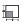
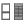
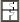
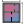
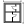
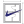

#Ostate Grasshopper Plugin

| 01. Settings | 02. Pattern | 03. Building | 04. Layout | 05. Details | 06. Post Processing | 07. Utility |
| --- | --- | --- | --- | --- | --- | --- |
|          |       |   |      |     |         |        |
# 01. Settings
##  Apartment Settings | Tower
**Name:** Apartment Settings | Tower  
**NickName:** Apartments|Tower  
**Description:** Setting the apartments properties for the tower patterns to generate.  

### Input
| Name | NickName | Description |
| ------ | ------ | ------ |
| Apartments Amount | Ap Amount | The number of apartments per floor. |
| Respectable Distance | rDistance | The distance from the short facade to the first apartment's separating wall. |
| SpaceTypes | sTypes | List of space types. _____________ This list is filling the spaces by types in a quick abstract method as follows:_______________ - 1 Space Type          ------> all spaces are same type. - 2 Space Types provided and pattern has 4 different cells' areas >> then the spaces are divided into:         ------> First smallest 2 cells areas are the first space type          ------> The second type is assigned to the other 2 cells areas |
### Output
| Name | NickName | Description |
| ------ | ------ | ------ |
| ApartmentSettings | ApSett | Settings for the apartments of the tower pattern. |
##  Boundary Settings
**Name:** Boundary Settings  
**NickName:** Boundary  
**Description:** Setting the outline/boundary dimensions of the pattern  

### Input
| Name | NickName | Description |
| ------ | ------ | ------ |
| Depth | Depth | Perpendicular distance from facade outer edge to the corridor wall on one side of the building. |
| Depth 2 | Depth 2 | Second Perpendicular distance from facade outer edge to the corridor wall on the other side of the building. |
### Output
| Name | NickName | Description |
| ------ | ------ | ------ |
| BoundarySettings | bouSett | Settings for the outline of the pattern. |
##  Boundary Settings | Corner
**Name:** Boundary Settings | Corner  
**NickName:** Boundary|Corner  
**Description:** Sets the boundary dimensions of the concave and the convex parts of the corner patterns. - Use this only for the corner patterns  

### Input
| Name | NickName | Description |
| ------ | ------ | ------ |
| Convex Depth | CX Depth | Convex corner: Perpendicular distance from facade outer edge to the corridor wall on one side of the building. |
| Convex Depth 2 | CX Depth2 | Convex Corner: Second Perpendicular distance from facade outer edge to the corridor wall on the other side of the building. |
| Concave Depth | Cc Depth | Concave corner: Perpendicular distance from facade outer edge to the corridor wall on one side of the building. |
| Concave Depth 2 | Cc Depth2 | Concave corner: Second Perpendicular distance from facade outer edge to the corridor wall on the other side of the building. |
| Corridor Extension | Cor Ext | Prefered Direction of extended corridor. - This allows you to have an extended corrridor to the facade cutting through the corner to form a T-Shaped corridor. 0 => None 1 => Primary 2 => Alternative |
### Output
| Name | NickName | Description |
| ------ | ------ | ------ |
| BoundarySettings | bouSett | Settings for the outline of the pattern. |
##  Core Interior Settings
**Name:** Core Interior Settings  
**NickName:** Core Interior  
**Description:** Setting the draftdesign of cores for the pattern. - This could be a core detailed design meshes and curves. - It is meant only for visualization purposes and not smart enough to fit and adjust it to your core dimensions.  

### Input
| Name | NickName | Description |
| ------ | ------ | ------ |
| Design Meshes | Meshes | These are all the meshes in your design,(i.e. walls, furniture..etc). You can input a colored mesh as well. NOTE: it has to be all unioned into One Mesh. a list is not possible |
| Design Curves | Curves | These are all the curves in your design. i.e. stairs steps..etc. |
| Entrance Edge | Entrance | This is one edge that represents the entrance full edge to this design. The start point of this edge will be matching the start point of your core circulation curve |
### Output
| Name | NickName | Description |
| ------ | ------ | ------ |
| Core Interior Settings | IntSett | Settings for the Interior design of the pattern's core. |
##  Core Settings
**Name:** Core Settings  
**NickName:** Core  
**Description:** Setting the core properties and dimensions for the pattern  

### Input
| Name | NickName | Description |
| ------ | ------ | ------ |
| Core Type | Type | Have a core or no-core in the pattern.   - Note: Some patterns don't allow 'no-Core'. These are patterns that are designed based on the existiance of a core.(i.e: End02)  0 => NoCore 1 => WithCore |
| Core Width | Width | Width of the core that is parallel to the corridor. If the Width is 0 it will be assigned the OstateDefaults value => DefaultsCoreStairWidth |
| Core Depth | Depth | Depth of the core that is perpendicular to the corridor. If the Depth is 0 it will be assigned the OstateDefaults value => DefaultsCoreStairDepth |
| Flip Core Side? | Flip? | Flip the core over corridor side |
| << Core Interior Settings | << IntSett | Optional settings for the Interior design of the pattern's core. |
### Output
| Name | NickName | Description |
| ------ | ------ | ------ |
| Core Settings | coSett | Settings for the core of the pattern. |
##  Corridor Settings
**Name:** Corridor Settings  
**NickName:** Corridor  
**Description:** Setting the corridor properties and dimensions for the pattern  

### Input
| Name | NickName | Description |
| ------ | ------ | ------ |
| Corridor Width | Width | Width of the corridor.  if the corridor width is 0 it will be assigned the OstateDefaults value  => RegulationsCorridorWidth |
| Corridor Extension | Cor Ext | Distance from the deadend of the corridor to the parallel facade. |
| Core Shift | Cor Shift | Distance from the deadend of the corridor to the core. |
| Gallery Walls? | Gallery? | If the corridor is gallery, should it have walls? (i.e. double skine facade.) |
### Output
| Name | NickName | Description |
| ------ | ------ | ------ |
| CorridorSettings | CoSett | Settings for the corridor of the pattern. |
##  Core Settings | Double
**Name:** Core Settings | Double  
**NickName:** Double Core  
**Description:** Setting the double core properties and dimensions for the pattern. To have double cores each on one side of the corridor.  

### Input
| Name | NickName | Description |
| ------ | ------ | ------ |
| Core Type | Type | Have a core or no-core in the pattern.   - Note: Some patterns don't allow 'no-Core'. These are patterns that are designed based on the existiance of a core.(i.e: End02)  0 => NoCore 1 => WithCore |
| Core 1 Width | Width 1 | Width of the first core that is parallel to the corridor. If the Width is 0 it will be assigned the OstateDefaults value => DefaultsCoreStairWidth |
| Core 1 Depth | Depth 1 | Depth of the first core that is perpendicular to the corridor. If the Depth is 0 it will be assigned the OstateDefaults value => DefaultsCoreStairDepth |
| Core 2 Width | Width 2 | Width of the second core that is parallel to the corridor. If the Width is 0 it will be assigned the OstateDefaults value => DefaultsCoreStairWidth |
| Core 2 Depth | Depth 2 | Depth of the second core that is perpendicular to the corridor. If the Depth is 0 it will be assigned the OstateDefaults value => DefaultsCoreStairDepth |
| Flip Core Side? | Flip? | Flip the core over corridor side |
| << Core Interior Settings | << IntSett | Optional settings for the Interior design of the pattern's core. |
### Output
| Name | NickName | Description |
| ------ | ------ | ------ |
| DoubleCoreSettings | doubSett | Settings for the double core of the pattern. |
##  Floor Settings
**Name:** Floor Settings  
**NickName:** FloorSet  
**Description:** Setting the Floors properties and dimensions for the building block.  

### Input
| Name | NickName | Description |
| ------ | ------ | ------ |
| Floors Amount | Amount | Amount of floors |
| Floor Heights | Heights | List of heights for each of the floors, last number will be repeated for remaining floors |
| Floor Thicknesses | fThickness | List of thickness for each of the floors slabs, last number will be repeated for remaining floors |
| Roof Thickness | rThickness | Thickness of the last top floor slab |
| Trimming Distance | TDistance | This is the offset/inset distance for the floors from their original boundary.  The first number = GroundFloor, SecondNumber = second Floor 0 = no offset +Positive = offset -Negative = Flip Offset |
### Output
| Name | NickName | Description |
| ------ | ------ | ------ |
| FloorSettings | fSett | Settings for the Floors of the builidng block. |
##  Structure Settings
**Name:** Structure Settings  
**NickName:** Structure  
**Description:** Setting the structure cells properties for the pattern  

### Input
| Name | NickName | Description |
| ------ | ------ | ------ |
| Straight Span | sSpan | The span between straight cells in the straight regions. - If Loadbearing grid is input as well. then these two will define the cells boundaries. |
| Corner Span | cSpan | The span/width of the cells in the corner regions. |
| Corner Type | CT | The type of the corner regions' cells. 0 => Grid 1 => Straight 2 => HalfStraight |
| Loadbearing Grid | Bearing | Structure loadbearing Grid lines to be used within the cell generation as a cell border - If Straight Span is input as well. then these two will define the cells boundaries. |
| Non-Loadbearing Grid | Non-Bearing | Additional division non-loadbearing grid to be used within the cell generation as a cell border not considered as structural load bearing walls. |
### Output
| Name | NickName | Description |
| ------ | ------ | ------ |
| StructureSettings | strSett | Settings for the Structure cells of the pattern. |
# 02. Pattern
##  Make Duplex
**Name:** Make Duplex  
**NickName:** Duplex  
**Description:** Create Row houses, penthouses or any duplex spaces. These are spaces that have multiple floors belonging to one entitiy/space. The output will be only your base floor Plug this into 'Make Building Block' to define the floor settings.  

### Input
| Name | NickName | Description |
| ------ | ------ | ------ |
| Drawing Curve | Curve | The curve along which the duplex spaces will be created. If you specify a corridor this will be the outer edge of the corridor |
| Cores Positions | CorePts | These are indicating that a core will be coming from other floors, top or below. The cell containing these pts will be created as a core. Not as a functional space |
| SpaceTypes | sTypes | List of space types. _____________ This list is filling the spaces by types in a quick abstract method as follows:_______________ - 1 Space Type          ------> all spaces are same type. - 2 Space Types provided and pattern has 4 different cells' areas >> then the spaces are divided into:         ------> First smallest 2 cells areas are the first space type          ------> The second type is assigned to the other 2 cells areas |
| << PatternSettings | pSett | Compiled Settings from the 'Pattern Settings' component. |
### Output
| Name | NickName | Description |
| ------ | ------ | ------ |
| Building | Building | Building made out of the custom pattern your building out of this pattern can be used right away into any ostate operations as a building. i.e. walls generation..etc |
##  Make Handmade
**Name:** Make Handmade  
**NickName:** Handmade  
**Description:** Create pattern building from cells/spaces boundaries Note:If your curves/Spaces are not forming one block/ touching then your areas calculations from Ostate won't be correct. Instead make a separate pattern for each separate block of spaces, Makes sense right?  

### Input
| Name | NickName | Description |
| ------ | ------ | ------ |
| Spaces Boundaries | Spaces | Curves that need to be treated as cells/spaces |
| Cores Boundaries | Cores | Curves that need to be treated as Cores |
| Corridors Boundaries | Corridors | Curves that need to be treated as Corridors |
| Facade Edges | Facade | Facade curves if needed. These facade curves will be ignored or updated if you use this pattern tobe merged with patterns in 'Make Building Block' component. You can use the building block of this pattern right away into the walls generation or any other ostate operations |
| SpaceTypes | sTypes | List of space types. _____________ This list is filling the spaces by types in a quick abstract method as follows:_______________ - 1 Space Type          ------> all spaces are same type. - 2 Space Types provided and pattern has 4 different cells' areas >> then the spaces are divided into:         ------> First smallest 2 cells areas are the first space type          ------> The second type is assigned to the other 2 cells areas |
| << PatternSettings | pSett | Compiled Settings from the 'Pattern Settings' component. |
### Output
| Name | NickName | Description |
| ------ | ------ | ------ |
| Building | Building | Building made out of the custom pattern your building out of this pattern can be used right away into any ostate operations as a building. i.e. walls generation..etc |
##  Make Linear
**Name:** Make Linear  
**NickName:** Linear  
**Description:** 1- Parses the input curve to decide the amount of Ends, Corners and Middle patterns required as an input. 2- Register the Settings input of the Patterns. 3- Create patterns and generate their geometry  

### Input
| Name | NickName | Description |
| ------ | ------ | ------ |
| Drawing Midline | MidLine | Curve representing the midline of the patterns corridor to be drawn. Every discontinuity pt would affect how many patterns you have |
### Output
| Name | NickName | Description |
| ------ | ------ | ------ |
| Buildings | Buildings | Buildings to merge into one if needed |
##  MakeTower
**Name:** MakeTower  
**NickName:** Tower  
**Description:** Creat a tower building pattern from a tower algorithm  

### Input
| Name | NickName | Description |
| ------ | ------ | ------ |
| Boundary Curve | Boundary | Curve that represnts the outer boundary of the tower |
| << PatternSettings | pSett | Compiled Settings from the 'Pattern Settings' component. |
### Output
| Name | NickName | Description |
| ------ | ------ | ------ |
| Building | Building | Building from the tower pattern. - You could use it right away to generate walls or windows or layout. depending on your goal. |
##  Pattern Library
**Name:** Pattern Library  
**NickName:** Algo Library  
**Description:** Library with all Pattern Algorithms Click the button to open the library in your default browser and check their design possibilities.  

### Output
| Name | NickName | Description |
| ------ | ------ | ------ |
| Algorithms | Algos | All Ostate Pattern Algorithms |
##  Pattern Settings
**Name:** Pattern Settings  
**NickName:** PSett  
**Description:** All settings that would decide the pattern properties and design  

### Input
| Name | NickName | Description |
| ------ | ------ | ------ |
| PatternAlgorithm | Algo | Pattern algorithm that will be constructed. Use the Algorithm Library component to choose your pattern design. |
| << All Settings | << All | - All settings objects that would be assigned/combined in/to one pattern settings. - Stuff all of them here together - Use the 'Suggest right click on this param to suggest for you what settings you need here. but first let it know which Algorithm you are using. |
### Output
| Name | NickName | Description |
| ------ | ------ | ------ |
| PatternSettings | pSett | Compiled Settings for any 'PatternSettings' input. |
# 03. Building
##  MergeBuildings
**Name:** MergeBuildings  
**NickName:** Merge  
**Description:** Make a building out of all the Patterns or Buildings. This will consider the adjacency of all patterns. Facades and corridors will be merged if possible.  

### Input
| Name | NickName | Description |
| ------ | ------ | ------ |
| Buildings | Buildings | Patterns buildings to merge into one building. |
| Roof Thickness | rThick | Thickness of the last top floor slab. |
| Name | Name | Name of the building |
### Output
| Name | NickName | Description |
| ------ | ------ | ------ |
| Building | Building | Patterns or Buildings merged into one building |
##  Solve Building Adjacency
**Name:** Solve Building Adjacency  
**NickName:** Solve Adjacency  
**Description:** Find the adjacency between contextual masses, as breps, and an Ostate building.  

### Input
| Name | NickName | Description |
| ------ | ------ | ------ |
| Buildings | Buildings | Building to solve adjacency for |
| Adjacent Geometry | adj Geo | List of breps of contextual adjacent geometries that the building should consider while counting its facade openings.  Any floor that touches the nearby geometry will have no facade opening or balcony on the adjacent edges. |
| Tolerance | T | Maximum distance from which the geometry is considered adjacent. |
### Output
| Name | NickName | Description |
| ------ | ------ | ------ |
| Buildings | Buildings | Building with contextual adjacency solved |
# 04. Layout
##  Balcony Type
**Name:** Balcony Type  
**NickName:** Balcony  
**Description:** Balcony to add to the space type  

### Input
| Name | NickName | Description |
| ------ | ------ | ------ |
| Type | T | Type Of the Balcony. Loggia/Interior or exterior balcony? 0 => Unset 1 => Exterior 2 => Interior |
| Area | Area | Balcony Area |
| Depth | Depth | Balcony Depth |
| Length | Length | Balcony Length |
| Position | Pos | Balcony Position. 0 => Start 1 => CornerOrStart 2 => Middle 3 => CornerOrMiddle 4 => End 5 => CornerOrEnd |
### Output
| Name | NickName | Description |
| ------ | ------ | ------ |
| SpaceType | Type | Space type after balcony options are added to it |
##  Generate Layout
**Name:** Generate Layout  
**NickName:** Layout  
**Description:** Generates floorplan layout on an Ostate building. Adds Spaces based on spacetypes and their program.  

### Input
| Name | NickName | Description |
| ------ | ------ | ------ |
| Buildings | Bldgs | Buildings to generate the layout on |
| << LayoutAlgorithms | << Algos | Layout generator algorithms. You can choose among the available Ostate LayoutAlgorithm components. This can be multiple algorithms and Ostate will iterate over their result to find the best that meets your 'Scoring Preference' Input. |
| << SpaceTypes | << sTypes | Types of spaces to place in the buildings |
| Space weights | sWeights | Weights for each space that determines its ratio in relation to the other space types. |
| Weight By Area? | Area Weight | Weights' inputs are ratio of the total spaces areas or total count?  True: Ratio is by Area.  False: Ratio is by count |
| Iteration Scoring Preference | Score | Weight for iteration scoring criteria. Must be between 0 and 1. - Closer to 0 - closer to the desired spaces Areas, - Closer to 1 - closer to the desired spaces ratio. If ALgorithm is OneCellOneSpace then no iterations will happen. If One space type is provided then also no iteration will happen. |
| Pre-generated Buildings | preGen | Buildings with existing programme. The exisitng program/ spaces in these buidlings will be considered as part of the spaces' types ratios. So they all together with the input building here form one layout program. |
| GFA or UFA? | Gfa Ufa | input areas for SpaceTypes are in GFA(GrossfloorArea) or in UFA(UsableFloorArea) GFA = 1 UFA = 0 |
### Output
| Name | NickName | Description |
| ------ | ------ | ------ |
| Buildings | Bldgs | Buildings with layout spaces generated |
| LayoutSummary | Summary | Numerical data summary for the best option based on the iteration scoring preference. |
##  Grow On Cells
**Name:** Grow On Cells  
**NickName:** Grow Algo  
**Description:** Layout generation algorithm: Each cell will be tested to fit a space of a certain type. Otherwise it will be merged with the neighbouring cells until it matches the requirements for a certain space type.  

### Input
| Name | NickName | Description |
| ------ | ------ | ------ |
| Order By Level? | By Level? | If true, the generation will flow level by level among all the buildings.Otherwise it will fill one building, then another. |
| Larger Corners? | lCorner? | larger apartments are prefered to be in the corners of the floorplan? |
| Strict Space Weights? | Strict | If False: for any leftover cells, Fill in as many spaces as possible even if the weights are going to be less accurate. |
| Accuracy | Acc | Choose whether you want potentially more accurate results, or faster generation. 0 => Quick 1 => Balanced 2 => Accurate |
| Default Leftover Space Type | Default Type | Defaut space type for cells that didn't find a matching spacetype. |
| Leftovers Behaviour | leftover | Behaviour for dealing with leftover cells.  Wether to: - Fill with the default space type input. - Merge leftovers and fill with the the default space type input - Merge leftovers and fill with closest space available  --------- 0 => FillDefault 1 => MergeAndFillDefault 2 => AddToClosestSpace |
### Output
| Name | NickName | Description |
| ------ | ------ | ------ |
| GrowOnCells | Algo | Layout generator algorithm |
##  One Cell One Space
**Name:** One Cell One Space  
**NickName:** OneOne  
**Description:** Layout generation algorithm: Each Cell will be considered as a one separate Space.  

### Input
| Name | NickName | Description |
| ------ | ------ | ------ |
| Consider Min Area | cMinArea | When searching for a suitable space type that fits into the cell, consider the min area of the type. |
| Consider Max Area | cMaxArea | When searching for a suitable space type that fits into the cell, consider the max area of the type. |
| Consider Circulation | cCirc | When searching for a suitable space type that fits into the cell, consider the min circulation length of the type. |
| Consider Facade | cFacade | When searching for a suitable space type that fits into the cell, consider the min facade length of the type. |
| Default Leftover Space Type | Default Type | Defaut space type for cells that didn't find a matching spacetype. |
| Leftovers behaviour | leftover | Behaviour for dealing with leftover cells.  Wether to: - Fill with the default space type input. - Merge leftovers and fill with the the default space type input - Merge leftovers and fill with closest space types available. This runs a simplified version of GrowonCell algo.  --------- 0 => FillDefault 1 => MergeAndFillDefault 2 => MergeAndFill |
### Output
| Name | NickName | Description |
| ------ | ------ | ------ |
| OneCellOneSpace | Algo | Layout generator algorithm. |
##  Space Type
**Name:** Space Type  
**NickName:** SpaceType  
**Description:** Define a space type  

### Input
| Name | NickName | Description |
| ------ | ------ | ------ |
| Name | Name | Type name |
| Room Count | rCount | Number of rooms |
| Min Area | Min | Minimum Area. This could be UFA(UsableFloorArea) or GFA(GrossFloorArea). You define Which area type it is later in the 'Generate Layout' component. |
| Max area | Max | Maximum area This could be UFA(UsableFloorArea) or GFA(GrossFloorArea). You define Which area type it is later in the 'Generate Layout' component. |
| Min Circulation | Circulation | Minimum circulation length needed |
| Min Facade | Facade | Minimum facade length needed |
| Window to Wall Ratio | WWR | Window to wall ratio between 0 - 1 |
| Space Color | Color | Color for visualization of the space |
| Function | Func | Function of the space: 0 => Unset 1 => Apartment 2 => Commercial |
| Balcony Type | Balcony | Balcony to be added to the space type |
### Output
| Name | NickName | Description |
| ------ | ------ | ------ |
| SpaceType | Type | Space type object |
# 05. Details
##  Add Windows
**Name:** Add Windows  
**NickName:** AddWindows  
**Description:** Add/Place windows on Building's spaces  

### Input
| Name | NickName | Description |
| ------ | ------ | ------ |
| Building | Building | Building to generate the windows on its facade |
| Sill Height | sHeight | Distance between Floor and the start of the window. Height of the sill. |
| Ceiling Distance | cDistance | Distance between ceiling and the top of the window. |
| Break Distance | bDistance | Max distance between the beginning of two consecutive windows |
### Output
| Name | NickName | Description |
| ------ | ------ | ------ |
| Building | Building | Building with windows generated on each space |
##  Add Walls Thickness
**Name:** Add Walls Thickness  
**NickName:** AddWallsThickness  
**Description:** Add/Generate walls on floors. This Component also Finds UFA (UsableFloorArea) Boundary and registers its areas to each space.  

### Input
| Name | NickName | Description |
| ------ | ------ | ------ |
| Building | Building | Building to Generate walls for |
| << Wall Thickness Settings | << Thickness | Settings for wall types and their thickness/dimensions |
| << Wall Intersection Settings | << iSett | Intersection priority order for the walls. From Wall Intersection Settings. By default: LoadBearing >> Thickness >> Length |
### Output
| Name | NickName | Description |
| ------ | ------ | ------ |
| Building | Builidng | Building presented |
##  Wall Intersection Settings
**Name:** Wall Intersection Settings  
**NickName:** Wall Intersection  
**Description:** Specify the priority order for the wall intersections.  

### Input
| Name | NickName | Description |
| ------ | ------ | ------ |
| Load Bearing | LBearing | Weight of the parameter in deciding the intersection order. The higher the value the more priority the wall has. High priority walls cut lower priorites. |
| Thickness | Thick | Weight of the parameter in deciding the intersection order. The higher the value the more priority the wall has. High priority walls cut lower priorites. |
| Length | Length | Weight of the parameter in deciding the intersection order. The higher the value the more priority the wall has. High priority walls cut lower priorites. |
| Facade | Facade | Weight of the parameter in deciding the intersection order. The higher the value the more priority the wall has. High priority walls cut lower priorites. |
| Interior | Interior | Weight of the parameter in deciding the intersection order. The higher the value the more priority the wall has. High priority walls cut lower priorites. |
| Circulation | Circ | Weight of the parameter in deciding the intersection order. The higher the value the more priority the wall has. High priority walls cut lower priorites. |
### Output
| Name | NickName | Description |
| ------ | ------ | ------ |
| WallIntersectionSettings | iSett | Intersection Priority settings for the 'Add Walls Thickness' component |
##  Wall Thickness Settings
**Name:** Wall Thickness Settings  
**NickName:** WallThickness  
**Description:** Set the thickness of the walls per type  

### Input
| Name | NickName | Description |
| ------ | ------ | ------ |
| Unset | Unset | Thickness of Unset |
| StructuralInteriorWall | StructuralInteriorWall | Thickness of StructuralInteriorWall |
| InteriorWall | InteriorWall | Thickness of InteriorWall |
| StructuralFacadeWall | StructuralFacadeWall | Thickness of StructuralFacadeWall |
| FacadeWall | FacadeWall | Thickness of FacadeWall |
| StructuralPartingWall | StructuralPartingWall | Thickness of StructuralPartingWall |
| PartingWall | PartingWall | Thickness of PartingWall |
### Output
| Name | NickName | Description |
| ------ | ------ | ------ |
| WallThicknessSettings | Thicknes | thickness defined per wall type |
# 06. Post Processing
##  Export Data
**Name:** Export Data  
**NickName:** Export Data  
**Description:** Exports all the Numerical data available related to Ostate buildings  

### Input
| Name | NickName | Description |
| ------ | ------ | ------ |
| Buildings | buildings | Ostate Buildings to export their data. if Multiple buildings are input, they will be summed into the SiteSummary data. |
| Project Name | Name | Project name |
| Project Address | Address | Project address |
### Output
| Name | NickName | Description |
| ------ | ------ | ------ |
| Raw Data | Raw | Raw data of the variant that has no relation or dependencey on any other data. |
| Processed data | Processed | Processed data of the variant. all Data are rounded according to the Norms and regulations advice (if it exist) |
| Raw Data JSon | Raw Json | Serialized JSON that can be an input to the 'DesignScout Tools' to present on our Hub.OMRT.tech patform |
##  Export Honeybee
**Name:** Export Honeybee  
**NickName:** To HB  
**Description:** Exports Ostate spaces and windows into Geometry to be used in HoneyBee.  

### Input
| Name | NickName | Description |
| ------ | ------ | ------ |
| Building | Building | Building to extract geometries from |
| Floor Index | Floor | Floors to extract, no input = extract for all the floors |
| Space index | Space | Indices of spaces to extract, no input = extract for all the spaces |
### Output
| Name | NickName | Description |
| ------ | ------ | ------ |
| Spaces | S | Geometry of the spaces |
| Windows | W | Geometry of the windows |
| Cores | Cores | Geometry of the Cores |
| Corridors | Co | Geometry of the Corridors. If Gallery it will be a surface not extruded, this could be used as a shading surface |
##  Export IFC
**Name:** Export IFC  
**NickName:** To IFC  
**Description:** Exports Ostate building data into an IFC file.  

### Input
| Name | NickName | Description |
| ------ | ------ | ------ |
| Project Name | pName | Name of the project |
| Ostate Buildings | Build | Ostate generated building objects |
| File Path | Path | Full path including filename and extension. If file exists it will be overriden |
| Save | Save? | Generate IFC file and save it. |
### Output
| Name | NickName | Description |
| ------ | ------ | ------ |
| Output | Output | Output |
##  Area Colored Range
**Name:** Area Colored Range  
**NickName:** AreaColor  
**Description:** An interval with a color assigned  

### Input
| Name | NickName | Description |
| ------ | ------ | ------ |
| Min | Min | Min range |
| Max | Max | Max range |
| Color | Color | Color |
### Output
| Name | NickName | Description |
| ------ | ------ | ------ |
| Area Colored Range | Range | Area range with an assosiated color |
##  Export Floorplan
**Name:** Export Floorplan  
**NickName:** FPlan  
**Description:** Get colored floorplan mesh  

### Input
| Name | NickName | Description |
| ------ | ------ | ------ |
| Buildings | B | List of Buildings to export |
| Render Text | Text | True to have text description rendered |
| Extrude Spaces | Extrude | if true all the spaces will be extruded before being colored |
| << Color Settings | << Color | Color preview settings |
| << Text Settings | << Text | Text preview settings |
### Output
| Name | NickName | Description |
| ------ | ------ | ------ |
| Preview mesh | Mesh | Mesh of the floors |
| Extrusions Wireframes | Wireframes | if the extrusion parameter is selected then the extrusions of the spaces breps are returned here joined |
| Text Data | Text | Text data to be exploded |
##  Export Floorplan | 2D
**Name:** Export Floorplan | 2D  
**NickName:** PlotFP  
**Description:** Orient floor layouts on the plot and assign colors to spaces  

### Input
| Name | NickName | Description |
| ------ | ------ | ------ |
| Buildings | B | List of Buildings to export |
| Render Text | Text | True to have text description rendered |
| Plotting point | pt | Bottom left corner of plotted florplan. |
| Padding | Padding | A minimum padding between the floors |
| << Color Settings | << Color | Color preview settings |
| << Text Settings | << Text | Text preview settings |
### Output
| Name | NickName | Description |
| ------ | ------ | ------ |
| Preview mesh | Mesh | Mesh of the floors |
| Vectors | Vec | List of Translation Vectors for each floor |
| Text Data | Text | Text data to be exploded |
##  Floorplan Color Settings
**Name:** Floorplan Color Settings  
**NickName:** FPColor  
**Description:** Color settings for the floorplan component  

### Input
| Name | NickName | Description |
| ------ | ------ | ------ |
| << Area Colored Ranges | << Ranges | Highlight spaces within given area range.- To be used with 'Area Colored Range' component |
| Only Colored Ranges | OnlyRanges | Color only space types in specified area ranges |
| Default Space Color | dSpace | default Space Color. in case no color is provided |
| Wall Color | Wall | Wall Color |
| Core Color | Core | Core Color |
| Corridor Color | Corridor | Corridor Color |
### Output
| Name | NickName | Description |
| ------ | ------ | ------ |
| Floorplan Color Settings | Settings | Color settings for the floor plan component |
##  Floorplan Text Settings
**Name:** Floorplan Text Settings  
**NickName:** FPText  
**Description:** Text settings for the floorplan component  

### Input
| Name | NickName | Description |
| ------ | ------ | ------ |
| Space Text Display | SpaceTxt | Choose the text to preview on the spaces. Insert 3 booleans(true/false). - First is name,- Second is UFA- Third is GFA. For example: [true, true, false] wouldn't show the GFA area. |
| Core Text Display | CoreTxt | Choose the text to preview on the cores. Insert 3 booleans(true/false). - First is name,- Second is UFA- Third is GFA. For example: [true, true, false] wouldn't show the GFA area. |
| Corridor Text Display | CorridorTxt | Choose the text to preview on the corridors. Insert 3 booleans(true/false). - First is name,- Second is UFA- Third is GFA. For example: [true, true, false] wouldn't show the GFA area. |
| Font Size | fSize | Font size |
### Output
| Name | NickName | Description |
| ------ | ------ | ------ |
| FloorplanTextSettings | TextSettings | Additional text settings for the floorplan exporting components |
# 07. Utility
##  Arrange
**Name:** Arrange  
**NickName:** Arrange  
**Description:** Arrange geometry or ostate objects on a grid.  

### Input
| Name | NickName | Description |
| ------ | ------ | ------ |
| Geometry | Geo | Rhino or ostate objects |
| Base Point | Pt | Base point for the grid |
| Padding | Padding | Minimum distance between geometries |
### Output
| Name | NickName | Description |
| ------ | ------ | ------ |
| Geometry | Geo | Translated input geometry |
| TranslationVectors | Vec | Translation vector for each valid geometry |
##  Ostate Defaults
**Name:** Ostate Defaults  
**NickName:** ODefaults  
**Description:** Default values that are used in Ostate's backend and can be overriden.  

### Input
| Name | NickName | Description |
| ------ | ------ | ------ |
| Defaults Type | Type | Type of default values to access. 0 => Building 1 => Constants 2 => FloorplanValidator |
| Default Names | Names | list of names belongs to the values you want to modify/override |
| Default New Values | newValue | value to replace the default value indicated by the list of names |
### Output
| Name | NickName | Description |
| ------ | ------ | ------ |
| Ostate Defaults | ODefaults | All Ostate defaults within the specified type. |
##  Rename
**Name:** Rename  
**NickName:** Rename  
**Description:** Rename an ostate object.  

### Input
| Name | NickName | Description |
| ------ | ------ | ------ |
| Object | Obj | Ostate object to rename |
| Name | Name | New name of the object |
### Output
| Name | NickName | Description |
| ------ | ------ | ------ |
| Object | Obj | Renamed object |
##  Create Structural Lines
**Name:** Create Structural Lines  
**NickName:** Structural Lines  
**Description:** Construct lines dividing a curve. This is controlable on both sides of the curve.  

### Input
| Name | NickName | Description |
| ------ | ------ | ------ |
| Curve | Curve | Curve to create grid lines on. This can be a polyline or any curve with multiple segments. |
| Division Sides | Sides | Which side of the curve to create grid lines on. 0 => Both 1 => Right -1 => Left |
| First Distance | fDist | Distance from first end (Start) of the curve segment to be respected before starting division. |
| Span | Span | Distance or a List of Distances in between first and last end of the curve segment. |
| Last Distance | lDist | Distance from last end (end) of the curve segment to be respected before ending division. |
| Length of lines | dl | Length of each sructural line on each side. If Both is chosen for the 'Division Sides' input, then this amount will be applied to each side of the structure lines. |
| Tolerance | Tol | Tolerance after which the base curve will be either trimmed or extended to fit another structure line |
### Output
| Name | NickName | Description |
| ------ | ------ | ------ |
| Grid Lines | Lines | Structural Grid lines |
| Points | Pts | Points subdividing the curve |
| Adjusted Curve | Adj Curve | Curve Adjusted based on the tolerance. |
##  UFA Estimator
**Name:** UFA Estimator  
**NickName:** UFA  
**Description:** this component helps you to estimate the UFA area based on the Span, depth and walls thickness to use for a space. Use the same wall thickness you input here into your AddWallsThickness component.  

### Input
| Name | NickName | Description |
| ------ | ------ | ------ |
| << WallThicknessSettings | Thickness | Thickness defined per wall type. This is from 'Wall Thickness Settings' component |
| Depth | depth | Depth of the space. This is the Gross depth. From the facade external edge to the corridor edge. Don't think of any walls thickness here. |
| Span | span | Span of the space. This is the Gross span. From the midline of the interior wall to the other side's midline interior wall. Don't think of any walls thickness here. |
| UFA | UFA | UFA area of the space. This is the net UFA Area. UFA = Usable Floor Area of the space |
| Gallery? | gallery? | is the corridor a gallery? then spaces have a facade thickness wall on both sides. |
### Output
| Name | NickName | Description |
| ------ | ------ | ------ |
| GFA | bvo | GFA area of the space. This is the gross floor area of the space based on the inputs GFA = Gross floor area. |
| Depth | depth | Depth of the space. This is the Gross depth. From the facade external edge to the corridor edge. Don't think of any walls thickness here. |
| Span | span | Span of the space. This is the Gross span. From the midline of the interior wall to the other side's midline interior wall. Don't think of any walls thickness here. |
| UFA | UFA | UFA area of the space. This is the net UFA Area. UFA = Usable Floor Area of the space |
##  Floorplan Validator
**Name:** Floorplan Validator  
**NickName:** Validator  
**Description:** Validates the floorplan  

### Input
| Name | NickName | Description |
| ------ | ------ | ------ |
| Floor boundary | Floor | A floor boundary |
| Corridor boundary | Corridor | A corridor boundary |
| Apartment boundaries | Apts | Apartment boundaries |
| Core boundaries | Core | Core boundaries |
| Core has staircase | Stair | Core has staircase |
| Core has elevator | Elevator | Core has elevator |
### Output
| Name | NickName | Description |
| ------ | ------ | ------ |
| Results | Results | Results object This contains the apartments and corridor result objects as well use the explode component from the ostate utilities to get all the data |
##  Floorplan Validator Ostate
**Name:** Floorplan Validator Ostate  
**NickName:** ValidateOstate  
**Description:** Validates the floorplans of Ostate Buildings  

### Input
| Name | NickName | Description |
| ------ | ------ | ------ |
| Ostate Building | Building | OstateBuilding to do the validation for |
| Ostate Floors | Floors | Ostate Floors to validate. In case you don't need the whole building to be validated |
### Output
| Name | NickName | Description |
| ------ | ------ | ------ |
| Building Results | BuildingRes | list of floor Results object for all the building's floors. This contains the apartments and corridor result objects as well use the explode component from the ostate utilities to get all the data |
| Floors Results | FloorsRes | list of floor Results object for all separate inputed floors. This contains the apartments and corridor result objects as well use the explode component from the ostate utilities to get all the data |
